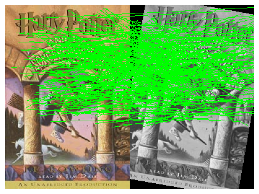

# Homography-Panoramic-Perception

This project implements augmented reality techniques using planar homographies. It includes functions for feature detection, matching, and image warping to create augmented reality effects.
## Implementation:

For a panoramic view enhancement, here are few examples of implementation:

And the preliminary matching for this image occurs like this:

By making adjustments to the way the program handles rotations in the image, rotation invariance can be handled

## Overview
The system uses a combination of feature detection, description, and matching algorithms to identify corresponding points between images. These correspondences are then used to compute homographies, which allow for the warping of one image onto another.

## Key Components

### Feature Detection
The project uses the **FAST** (Features from Accelerated Segment Test) corner detector for identifying interest points in images. FAST is computationally efficient compared to traditional methods like the Harris corner detector:
- It examines a circular set of 16 pixels around each point.
- A corner is detected if at least 9 contiguous pixels are significantly brighter or darker than the central pixel.
- This approach is much faster than calculating gradients and matrices, making it suitable for real-time applications.

### Feature Description
**BRIEF** (Binary Robust Independent Elementary Features) is used for describing the detected features:
- BRIEF is a binary descriptor, representing features as a string of 1s and 0s.
- It randomly samples pairs of pixels in an image patch and performs simple intensity comparisons.
- The resulting descriptor is compact and efficient to compute and match.

### Feature Matching
Matching is performed using the **Hamming distance** and **Nearest Neighbor algorithm**:
- The Hamming distance measures the number of differing bits between two binary strings.
- Nearest Neighbor matching finds the descriptor in the second image with the smallest Hamming distance to each descriptor in the first image.
- This combination allows for rapid matching, making it suitable for real-time applications.

### Homography Computation
The project implements functions to compute homographies between images:
- **Direct Linear Transform (DLT)** is used to solve for the homography matrix.
- **RANSAC (Random Sample Consensus)** is employed to robustly estimate homographies in the presence of outliers.

## Main Functions
- **`matchPics`**: Detects features, computes descriptors, and matches them across two images.
- **`computeH`**: Computes the homography between two sets of corresponding points.
- **`computeH_norm`**: Computes the homography using normalization for improved numerical stability.
- **`computeH_ransac`**: Estimates the homography robustly using RANSAC.
- **`compositeH`**: Creates a composite image by warping one image onto another using a homography.

## Usage
- Make sure all requirements are installed in your system
- Run **`main.py`** segmentwise depending on the use case
